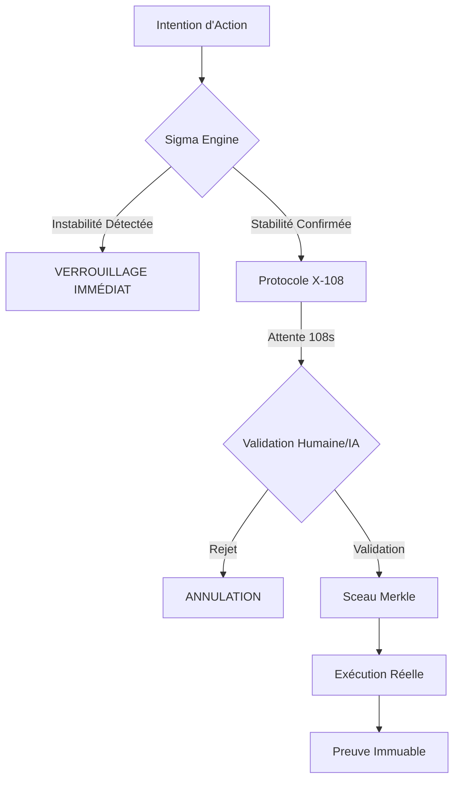

# Architecture Technique : Obsidia X-108

Obsidia repose sur une approche de **Gouvernance Déterministe**. Contrairement aux systèmes de sécurité classiques qui réagissent *après* une intrusion, Obsidia empêche l'exécution de toute action qui ne respecte pas une preuve formelle de sécurité.

## Flux d'Exécution Sécurisé

## 1. Le Protocole X-108 (Le Frein Temporel)
Le protocole **X-108** impose un délai de **108 secondes** sur toutes les transactions ou commandes identifiées comme critiques. 

*   **Pourquoi 108 secondes ?** C'est le temps nécessaire pour qu'un humain ou un système de surveillance puisse invalider une action automatisée malveillante (bot, flash-loan attack).
*   **Neutralisation de la Vélocité :** En brisant la vitesse d'exécution des attaquants, nous rendons les attaques économiquement non rentables.

## 2. Sigma Engine (Le Gyroscope de Stabilité)
Le moteur **Sigma** surveille en temps réel la "vibration" du système. 

*   **Calcul de Stabilité :** Il utilise des algorithmes de détection d'anomalies pour mesurer l'écart-type des opérations.
*   **Seuil de Rupture :** Si le système dépasse un seuil de "bruit" (instabilité), Sigma verrouille automatiquement le noyau avant que l'action ne soit propagée.
*   **Code Source :** Implémenté en Python (`sigma_monitor.py`) pour une analyse haute performance.

## 3. Preuves Merkle (Le Sceau d'Intégrité)
Chaque état du système est condensé dans une racine de Merkle.

*   **Immuabilité :** Une fois qu'une action est validée par Sigma et a passé le délai X-108, elle est scellée.
*   **Vérification Formelle :** N'importe quel auditeur peut utiliser le script `verify_merkle.py` pour prouver que l'état actuel du système n'a pas été altéré.
*   **Lean 4 :** Les fonctions critiques de hachage et de transition d'état sont prouvées mathématiquement via l'assistant de preuve Lean 4.

---
*Obsidia : La sécurité par la preuve, pas par la détection.*

🔗 **Accéder à l'App :** [https://ais-dev-eflc7fh363ofplr7vj5kfa-422332693421.europe-west2.run.app](https://ais-dev-eflc7fh363ofplr7vj5kfa-422332693421.europe-west2.run.app)
